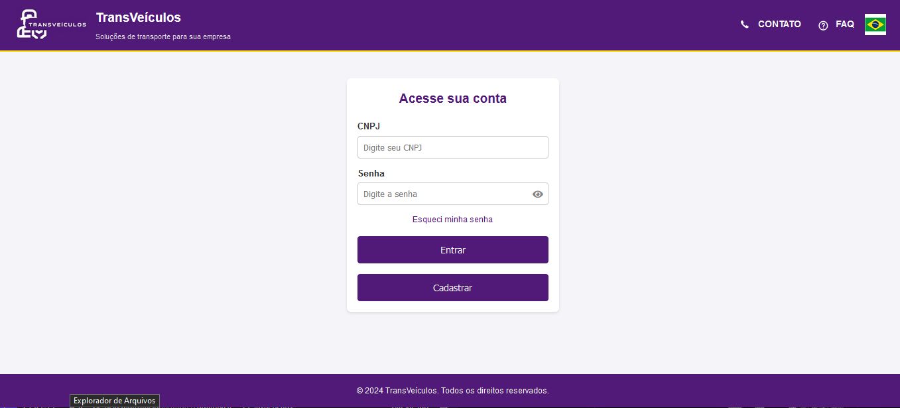
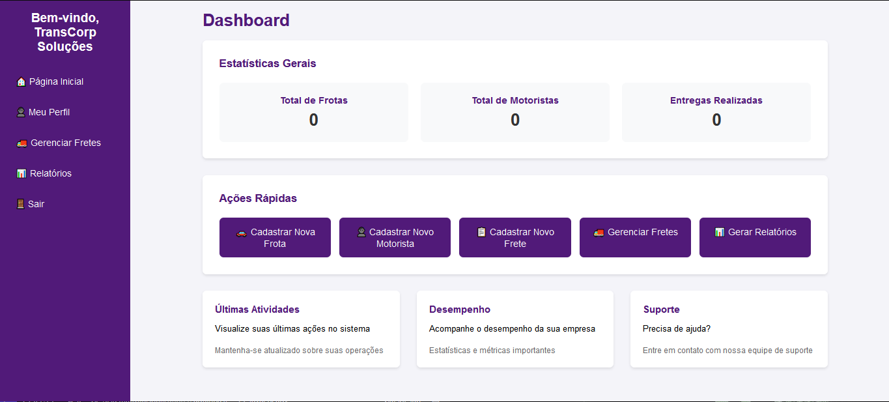
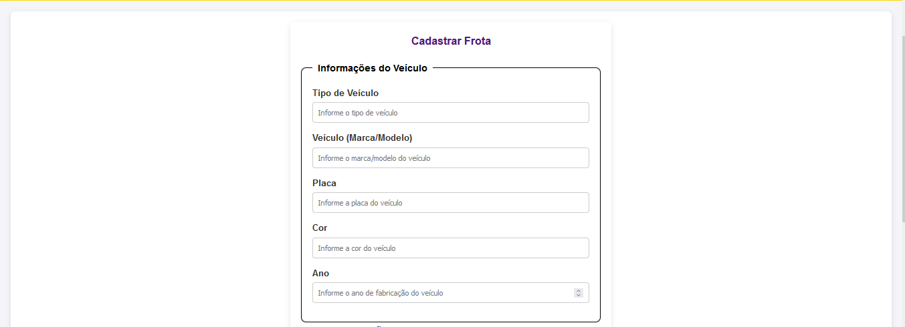
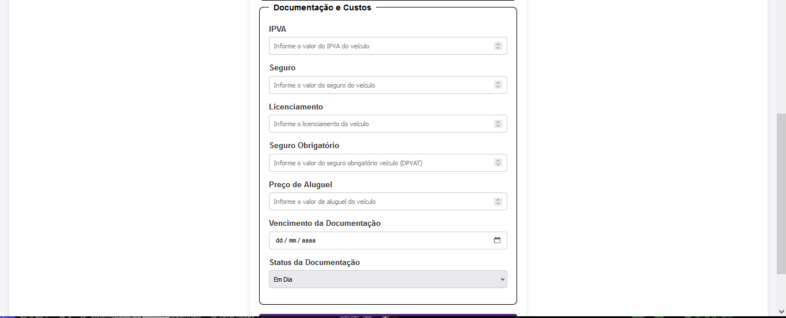

# TransVeículos - Sistema de Gerenciamento de Frota 🚛

## 📋 Sobre o Projeto
TransVeículos é um sistema web desenvolvido como projeto acadêmico para o CEFET-NI, com o objetivo de transformar uma planilha de controle de frota em uma aplicação web moderna e funcional. O projeto nasceu a partir de um desafio proposto em sala de aula, onde recebemos uma planilha básica de controle de veículos e tivemos a liberdade de expandir e modernizar o conceito.

## 🎯 Motivação
A partir de uma simples planilha de Excel, visualizei a oportunidade de criar uma solução que não apenas digitalizasse o processo, mas também:
- Automatizasse o controle de documentação
- Facilitasse o gerenciamento de motoristas
- Permitisse o planejamento eficiente de fretes
- Oferecesse uma visão clara das operações em tempo real

## 💻 Tecnologias Utilizadas

### Backend
- **Java 17**
- **Spring Boot 3.2.2**
- **Spring Security** - Para autenticação e autorização
- **Spring Data JPA** - Para persistência de dados
- **MySQL** - Banco de dados
- **Lombok** - Redução de boilerplate
- **Gradlew** - Gerenciamento de dependências

### Frontend
- **Thymeleaf** - Template engine
- **HTML5/CSS3**
- **JavaScript**
- **SweetAlert2** - Para alertas e notificações
- **Bootstrap** - Framework CSS (opcional)

## 🚀 Funcionalidades

### 1. Gestão de Empresas
- Cadastro e autenticação de empresas
- Perfil personalizado
- Dashboard com informações relevantes

### 2. Gestão de Frota
- Cadastro completo de veículos
- Controle de documentação (IPVA, seguro, licenciamento)
- Alertas de vencimento de documentos

### 3. Gestão de Motoristas
- Cadastro de motoristas
- Controle de documentação (CNH)
- Histórico de fretes realizados

### 4. Gestão de Fretes
- Planejamento de fretes
- Acompanhamento em tempo real
- Registro de fretes realizados
- Histórico completo de operações

## 🔧 Como Usar

### Requisitos
- Java 17 ou superior
- MySQL 8.0 ou superior
- Gradlew

### Configuração
1. Clone o repositório
2. Configure o banco de dados no arquivo `application.properties`
properties:
spring.datasource.url=jdbc:mysql://localhost:3306/seu_banco
spring.datasource.username=seu_usuario
spring.datasource.password=sua_senha
3. Execute a aplicação

## 📱 Interfaces do Sistema

### Tela de Login

- Interface intuitiva para acesso ao sistema
- Recuperação de senha
- Registro de novas empresas

### Dashboard Principal

- Visão geral da frota
- Indicadores importantes
- Acesso rápido às principais funcionalidades

### Gestão de Frota

- Alertas de documentação

## 🎯 Objetivos Alcançados
- Transformação de uma planilha em um sistema web completo
- Interface intuitiva e responsiva
- Automatização de processos manuais
- Sistema de alertas e notificações
- Gestão eficiente de recursos

## 🔜 Próximos Passos
- Implementação de aplicativo mobile
- Integração com APIs de rastreamento
- Módulo de relatórios avançados
- Sistema de manutenção preventiva

## 👨‍💻 Autor
Tayronne A.
- GitHub: [@TayronSilva](https://github.com/TayronSilva)
- LinkedIn: [Tayronne Silva](https://www.linkedin.com/in/tayronne-silva/)

## 📝 Licença
Este projeto está sob a licença [MIT](LICENSE).

## 🙏 Agradecimentos
- Professor Francisco Henrique pela orientação e desafio proposto
- CEFET-NI pela oportunidade de desenvolvimento
- Colegas de classe pelas sugestões e feedback
