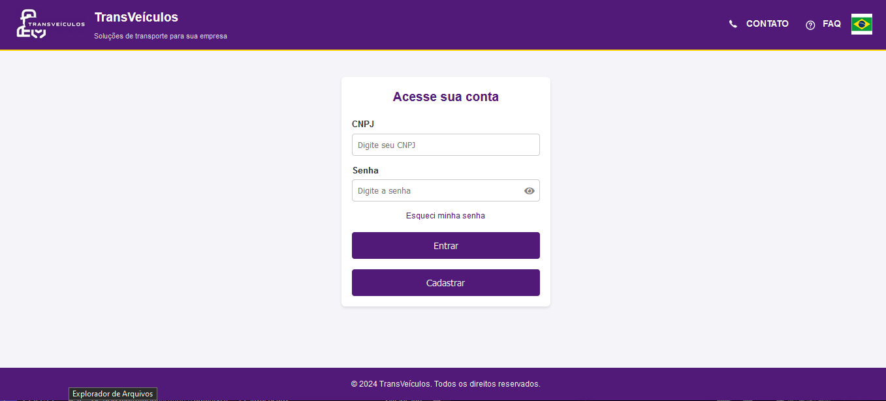
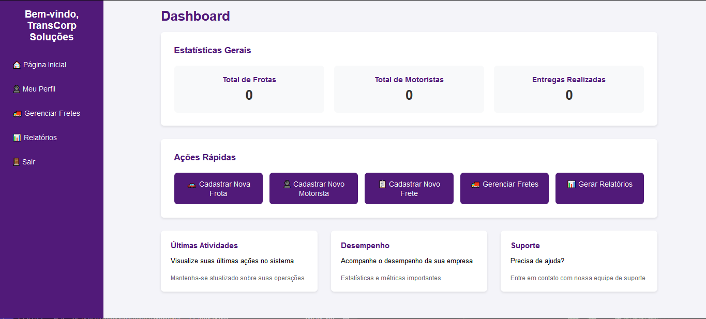
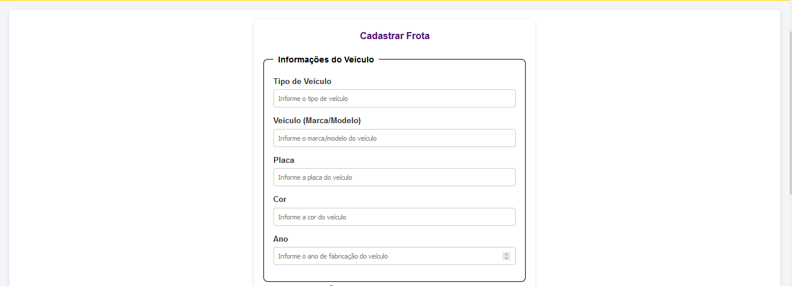
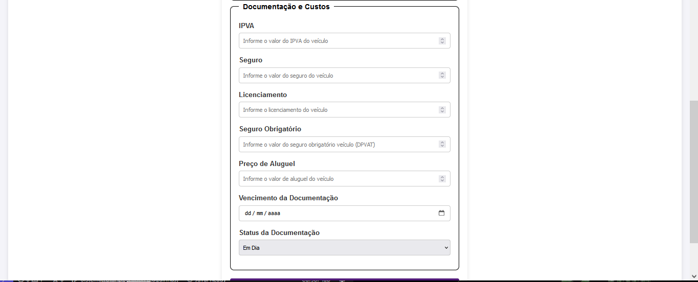

# TransVeículos - Fleet Management System 🚛

## 📋 About the Project
TransVeículos is a web-based system developed as an academic project for CEFET-NI, with the goal of transforming a fleet management spreadsheet into a modern and functional web application. The project originated from a classroom challenge, where we received a basic vehicle management spreadsheet and were given the freedom to expand and modernize the concept.

## 🎯 Motivation
Starting with a simple Excel spreadsheet, I saw an opportunity to create a solution that would not only digitize the process, but also:

- Automate document control
- Facilitate driver management
- Enable efficient freight planning
- Offer a clear view of operations in real time

## 💻 Technologies Used

### Backend
- **Java 23**
- **Spring Boot 3.2.2**
- **Spring Security** - For authentication and authorization
- **Spring Data JPA** - For data persistence
- **MySQL** - Database
- **Lombok** - Boilerplate reduction
- **Gradlew** - Dependency management

### Frontend
- **Thymeleaf** - Template engine
- **HTML5/CSS3**

- **JavaScript**
- **SweetAlert2** - For alerts and notifications
- **Bootstrap** - CSS framework (optional)

## 🚀 Features

### 1. Company Management
- Company registration and authentication
- Personalized profile
- Dashboard with relevant information

### 2. Fleet Management
- Complete vehicle registration
- Document control (IPVA, insurance, licensing)
- Document expiration alerts

### 3. Driver Management
- Driver registration
- Document control (driver's license)
- History of completed freight deliveries

### 4. Freight Management
- Freight planning
- Real-time monitoring
- Record of completed freight deliveries
- Complete history of operations

## 🔧 How to Use

### Requirements
- Java 23 or higher
- MySQL 8.0 or higher
- Gradlew

### Configuration
1. Clone the repository
2. Configure the database in the `application.properties` file
properties:
spring.datasource.url=jdbc:mysql://localhost:3306/your_database
spring.datasource.username=your_username
spring.datasource.password=your_password
3. Run the application

## 📃 Prerequisites for Running the Project

Make sure your development environment has the following tools installed:

### JDK (Java Development Kit)
- **Version:** 23 or higher
- **Download:** [Oracle JDK](https://www.oracle.com/java/technologies/javase-downloads.html) or [OpenJDK](https://openjdk.org/)

### Gradle Wrapper (Gradlew)
- Gradlew is included in the project, but you need to have **Java** correctly configured to use it.

### MySQL
- **Version:** 8.0 or higher
- **Download:** [MySQL Community Server](https://dev.mysql.com/downloads/)

### Recommended IDEs
- **IntelliJ IDEA**
- **Eclipse**
- **Visual Studio Code** (with Java extensions configured)

After installing the prerequisites, follow the project configuration steps described above to run the application correctly.

## 📱 System Interfaces

### Login Screen

- Intuitive interface for accessing the system
- Password recovery
- Registration of new companies

### Main Dashboard

- Fleet overview
- Key indicators
- Quick access to main functionalities

### Fleet Management

- Documentation alerts

## 🎯 Achieved Objectives
- Transformation of a spreadsheet into a complete web system
- Intuitive and responsive interface
- Automation of manual processes
- Alert and notification system
- Efficient resource management

## 🖐 Next Steps
- Mobile application implementation
- Integration with tracking APIs
- Advanced reporting module
- Preventive maintenance system

## 👨‍💻 Author
Tayronne A.
- GitHub: [@TayronSilva](https://github.com/TayronSilva)
- LinkedIn: [Tayronne Silva](https://www.linkedin.com/in/tayronne-silva/)

## 🖍 License
This project is licensed under the [MIT](LICENSE) license.

## 🙏 Acknowledgements
- Professor Francisco Henrique for guidance and the proposed challenge
- CEFET-NI for the development opportunity
- Classmates for suggestions and feedback

